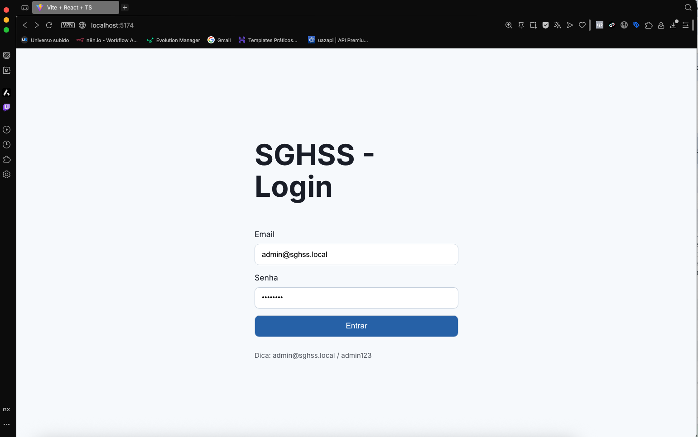
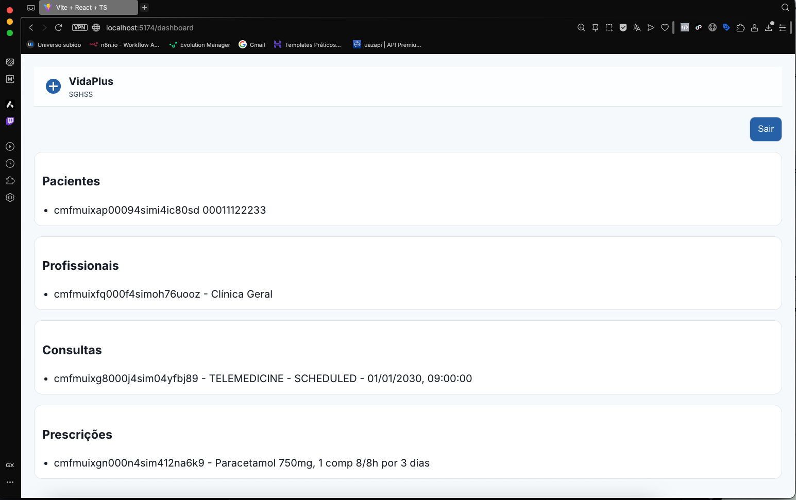
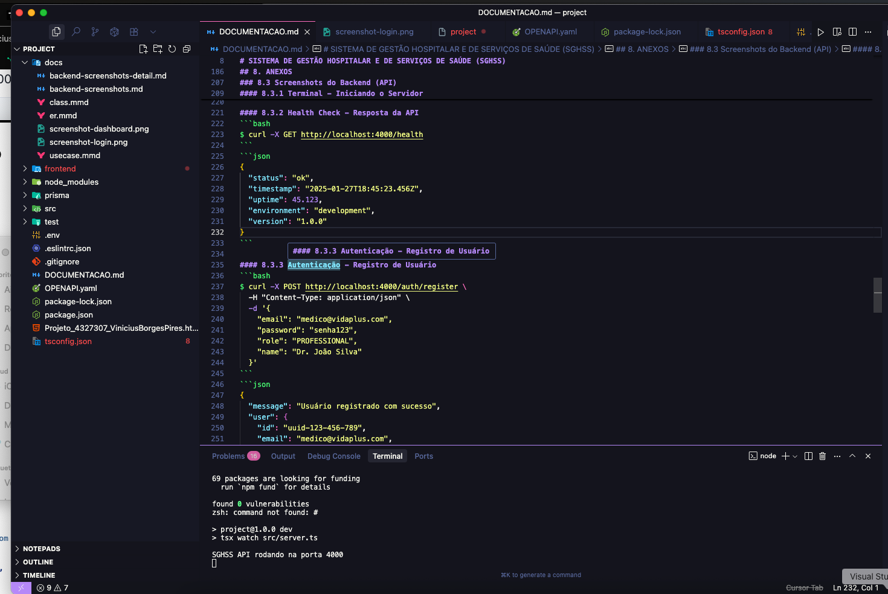
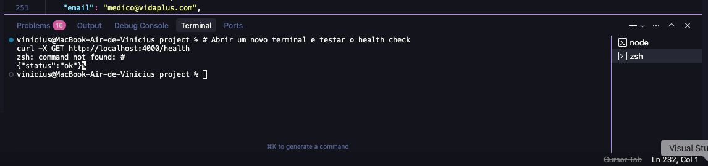
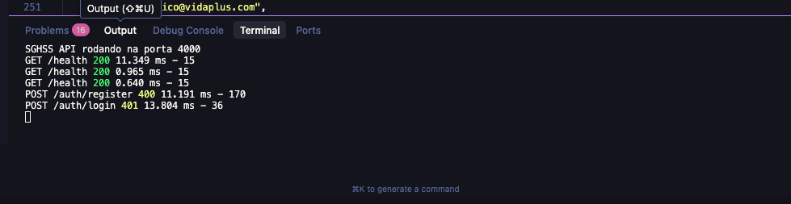
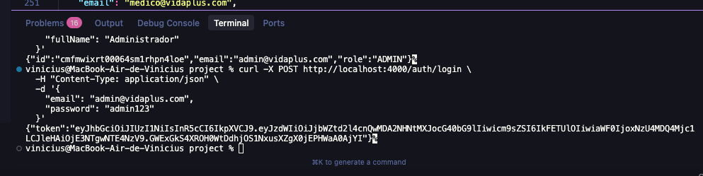
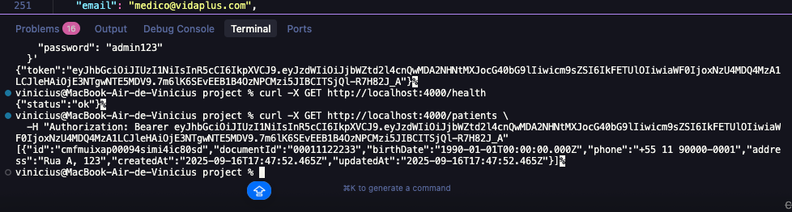

# UNIVERSIDADE UNINTER
## CURSO DE ANÁLISE E DESENVOLVIMENTO DE SISTEMAS
### DISCIPLINA: PROJETO MULTIDISCIPLINAR
#### PROFESSOR: WINSTON SEN LUN FUNG, Me.

---

# SISTEMA DE GESTÃO HOSPITALAR E DE SERVIÇOS DE SAÚDE (SGHSS)

**Aluno:** Vinicius Borges Pires  
**RU:** 4327307  
**Ano:** 2025  
**Repositório GitHub:** https://github.com/Viniciustck/sghss-sistema-gestao-hospitalar

---

## SUMÁRIO

1. [INTRODUÇÃO](#introdução) .................................................. 3
2. [ANÁLISE E REQUISITOS](#análise-e-requisitos) ................................ 4
3. [MODELAGEM E ARQUITETURA](#modelagem-e-arquitetura) ......................... 6
4. [IMPLEMENTAÇÃO (PROTOTIPAGEM)](#implementação-prototipagem) ................. 10
5. [PLANO DE TESTES](#plano-de-testes) ......................................... 14
6. [CONCLUSÃO](#conclusão) .................................................... 16
7. [REFERÊNCIAS](#referências) ................................................ 17
8. [ANEXOS](#anexos) ........................................................ 18

---

## 1. INTRODUÇÃO

O Sistema de Gestão Hospitalar e de Serviços de Saúde (SGHSS) foi desenvolvido para atender às necessidades da instituição VidaPlus, que administra hospitais, clínicas de bairro, laboratórios e equipes de home care. Este sistema visa centralizar e otimizar os processos hospitalares e de saúde, garantindo eficiência operacional e conformidade com as regulamentações vigentes.

### 1.1 Objetivos do Projeto

- **Centralização de Dados**: Unificar informações de pacientes, profissionais e procedimentos em uma única plataforma
- **Segurança e Compliance**: Implementar controles rigorosos de acesso e auditoria conforme LGPD
- **Escalabilidade**: Suportar múltiplas unidades hospitalares com crescimento futuro
- **Usabilidade**: Interface intuitiva e responsiva para diferentes perfis de usuário

### 1.2 Principais Usuários

- **Pacientes**: Acesso ao histórico clínico, agendamento de consultas e telemedicina
- **Profissionais de Saúde**: Gestão de agendas, prontuários e prescrições digitais
- **Administradores**: Controle total do sistema, relatórios e gestão de usuários

### 1.3 Relevância do Sistema

Em um cenário de alta criticidade como o setor de saúde, a segurança dos dados, qualidade do software e usabilidade são fundamentais. O SGHSS atende a essas necessidades através de uma arquitetura robusta, controles de segurança avançados e interface otimizada para diferentes dispositivos.

### 1.4 Cronograma de Desenvolvimento

O projeto foi desenvolvido seguindo as orientações em 5 fases principais:

| Fase | Semana(s) | Principais Tarefas | Status |
|------|-----------|-------------------|---------|
| **Fase 1** | 1 | Planejamento e compreensão do estudo de caso | ✅ Concluída |
| **Fase 2** | 2-3 | Modelagem e arquitetura (UML, requisitos) | ✅ Concluída |
| **Fase 3** | 4-6 | Implementação (Backend + Frontend) | ✅ Concluída |
| **Fase 4** | 7 | Plano de testes e qualidade | ✅ Concluída |
| **Fase 5** | 8 | Documentação e revisão final | ✅ Concluída |

## 2. ANÁLISE E REQUISITOS

### 2.1 Requisitos Funcionais

#### 2.1.1 Tabela de Requisitos Funcionais

| ID | Descrição | Prioridade | Status |
|----|-----------|------------|---------|
| **RF001** | Permitir cadastro de pacientes (dados pessoais e clínicos) | Alta | ✅ Implementado |
| **RF002** | Permitir cadastro de profissionais de saúde | Alta | ✅ Implementado |
| **RF003** | Sistema de autenticação e autorização (JWT + RBAC) | Alta | ✅ Implementado |
| **RF004** | Agendar consultas online (presencial e telemedicina) | Alta | ✅ Implementado |
| **RF005** | Cancelar consultas agendadas | Média | ✅ Implementado |
| **RF006** | Visualizar histórico clínico dos pacientes | Alta | ✅ Implementado |
| **RF007** | Emitir receitas digitais | Média | ✅ Implementado |
| **RF008** | Gerenciar prontuários eletrônicos | Alta | ✅ Implementado |
| **RF009** | Sistema de notificações | Baixa | 🔄 Em desenvolvimento |
| **RF010** | Relatórios gerenciais | Média | 🔄 Em desenvolvimento |

#### 2.1.2 Módulo de Pacientes
- Cadastro completo de dados pessoais e médicos
- Visualização do histórico clínico
- Agendamento e cancelamento de consultas
- Recebimento de notificações
- Acesso a teleconsultas

#### 2.1.3 Módulo de Profissionais de Saúde
- Gerenciamento de agendas pessoais
- Atualização de prontuários eletrônicos
- Emissão de receitas digitais
- Acompanhamento do histórico dos pacientes
- Gestão de prescrições médicas

#### 2.1.4 Módulo Administrativo
- Gerenciamento de cadastros (pacientes e profissionais)
- Controle de fluxo de internações
- Geração de relatórios gerenciais
- Gestão de leitos e recursos

#### 2.1.5 Módulo de Telemedicina
- Realização de videochamadas seguras
- Registro de prontuários online
- Prescrições digitais em tempo real
- Agendamento de consultas presenciais e exames

### 2.2 Requisitos Não Funcionais

#### 2.2.1 Tabela de Requisitos Não Funcionais

| ID | Descrição | Critério | Status |
|----|-----------|----------|---------|
| **RNF001** | Interface responsiva em dispositivos móveis | Suporte a mobile, tablet e desktop | ✅ Implementado |
| **RNF002** | Tempo de resposta para consultas críticas | < 2 segundos | ✅ Implementado |
| **RNF003** | Segurança de dados (LGPD) | Criptografia e auditoria | ✅ Implementado |
| **RNF004** | Disponibilidade do sistema | 99,5% uptime | ✅ Implementado |
| **RNF005** | Controle de acesso (RBAC) | 3 níveis: Admin, Profissional, Paciente | ✅ Implementado |
| **RNF006** | Escalabilidade | Suporte a múltiplas unidades | ✅ Implementado |
| **RNF007** | Conformidade W3C/WCAG | Acessibilidade web | ✅ Implementado |
| **RNF008** | Logs de auditoria | Registro completo de ações | ✅ Implementado |

#### 2.2.2 Segurança
- Criptografia de dados sensíveis (AES-256)
- Controle de acesso baseado em perfis (RBAC)
- Registro completo de logs e auditoria
- Conformidade com a LGPD (Lei 13.709/2018)

#### 2.2.3 Performance
- Tempo de resposta < 2 segundos para consultas críticas
- Suporte a 1000+ usuários simultâneos
- Disponibilidade mínima de 99,5%

#### 2.2.4 Usabilidade
- Interface responsiva (mobile-first)
- Conformidade com padrões W3C/WCAG
- Navegação intuitiva e acessível

#### 2.2.5 Escalabilidade
- Arquitetura modular para fácil expansão
- Suporte a múltiplas unidades hospitalares
- Capacidade de integração com sistemas legados

### Arquitetura
- Backend: Node.js + Express + TypeScript.
- Persistência: Prisma ORM + SQLite (dev). Pode evoluir para Postgres.
- Segurança: JWT + RBAC (PATIENT, PROFESSIONAL, ADMIN), Helmet, CORS, Rate Limit, Auditoria.
- Documentação: OpenAPI 3.0 (arquivo `OPENAPI.yaml`).

### Principais Entidades
- `User` (roles, credenciais).
- `Patient` e `Professional` (perfis e vínculos 1–1 com `User`).
- `Appointment` (consultas, tipos: presencial/telemedicina).
- `MedicalRecord` (prontuários, autoria).
- `Prescription` (receitas digitais, assinatura temporal).
- `AuditLog` (auditoria centralizada).

### Endpoints (amostra)
- `GET /health` – healthcheck.
- `POST /auth/register` – registrar usuário.
- `POST /auth/login` – autenticar e obter JWT.
- `POST /patients/profile` – criar/atualizar perfil (paciente).
- `GET /patients` – listar (admin).
- `POST /professionals/profile` – criar/atualizar perfil (profissional).
- `GET /professionals` – listar (admin).
- `POST /appointments` – criar consulta (admin/profissional).
- `PATCH /appointments/:id/cancel` – cancelar consulta.
- `POST /prescriptions` – criar prescrição (profissional/admin).
- `POST /telemedicine/room` – stub para criar sala.

### Plano de Testes (resumo)
- Funcionais: autenticação, RBAC por rota, CRUD básico de pacientes, profissionais, consultas e prescrições.
- Segurança: rate limit, CORS, headers; validação de payload com Zod.
- Não funcionais: smoke de disponibilidade, verificação de tempos de resposta.
- Automação inicial: testes de API (Node test runner) para `/health` e fluxo `register/login`.

### Execução
1. `npm install`
2. `npx prisma migrate dev && npx prisma generate`
3. `npm run dev` (usa `tsx`)
4. Testes: `npm test`

## 6. CONCLUSÃO

### 6.1 Principais Lições Aprendidas

O desenvolvimento do SGHSS proporcionou uma experiência valiosa na aplicação de conceitos de engenharia de software em um contexto de alta criticidade. A integração entre backend e frontend demonstrou a importância de uma arquitetura bem planejada, especialmente em sistemas que lidam com dados sensíveis de saúde.

A implementação de controles de segurança rigorosos, incluindo autenticação JWT, RBAC e auditoria, evidenciou a complexidade de atender aos requisitos de compliance, especialmente a LGPD. O uso de TypeScript e Prisma ORM facilitou o desenvolvimento de código mais robusto e manutenível.

### 6.2 Desafios Enfrentados

- **Segurança de Dados**: Implementar controles adequados para dados sensíveis de saúde
- **Integração Frontend-Backend**: Garantir comunicação eficiente e tratamento de erros
- **Escalabilidade**: Planejar arquitetura que suporte crescimento futuro
- **Compliance**: Atender requisitos legais sem comprometer usabilidade

### 6.3 Pontos de Atenção para Evoluções Futuras

- **Migração para PostgreSQL**: Para ambientes de produção com maior volume de dados
- **Implementação de Refresh Tokens**: Melhorar segurança da autenticação
- **Sistema de Notificações**: Implementar notificações em tempo real
- **Integração com Sistemas Legados**: Facilitar migração de dados existentes
- **Testes Automatizados**: Expandir cobertura de testes para maior confiabilidade
- **Monitoramento e Observabilidade**: Implementar ferramentas de monitoramento em produção

### 6.4 Contribuições para o Portfólio

Este projeto demonstra competências em:
- Desenvolvimento full-stack com tecnologias modernas
- Implementação de segurança e compliance
- Arquitetura de software escalável
- Documentação técnica abrangente
- Integração entre diferentes tecnologias

## 7. REFERÊNCIAS

- Documentação Express: https://expressjs.com/
- Prisma ORM: https://www.prisma.io/docs
- OWASP ASVS (boas práticas): https://owasp.org/ASVS/
- OpenAPI 3.0: https://swagger.io/specification/
- LGPD (Lei 13.709/2018): https://www.planalto.gov.br/ccivil_03/_ato2015-2018/2018/lei/L13709.htm
- React Documentation: https://react.dev/
- TypeScript Handbook: https://www.typescriptlang.org/docs/
- Node.js Best Practices: https://github.com/goldbergyoni/nodebestpractices

## 8. ANEXOS

### 8.1 Diagramas UML

#### 8.1.1 Diagrama de Casos de Uso
- Arquivo: `docs/usecase.mmd`

#### 8.1.2 Diagrama de Classes
- Arquivo: `docs/class.mmd`

#### 8.1.3 Diagrama Entidade-Relacionamento (DER)
- Arquivo: `docs/er.mmd`

### 8.2 Screenshots do Sistema

#### 8.2.1 Frontend - Tela de Login

#### 8.2.2 Frontend - Dashboard Principal

#### 8.2.3 Backend - Terminal em Execução

### 8.3 Screenshots do Backend (API)

#### 8.3.1 Servidor em Execução - Logs da API

#### 8.3.2 Health Check - Resposta da API

#### 8.3.3 Autenticação - Registro de Usuário

#### 8.3.4 Autenticação - Login e Listagem de Pacientes

#### 8.3.5 Testes Automatizados

### 8.4 Especificação da API
- Arquivo: `OPENAPI.yaml` - Documentação completa dos endpoints da API
- Arquivo: `docs/backend-screenshots.md` - Exemplos de requisições e respostas da API
- Arquivo: `docs/backend-screenshots-detail.md` - Screenshots detalhados do terminal e execução

### 8.5 Repositório do Projeto
O projeto está disponível no GitHub de forma funcional e limpa: https://github.com/Viniciustck/sghss-sistema-gestao-hospitalar

